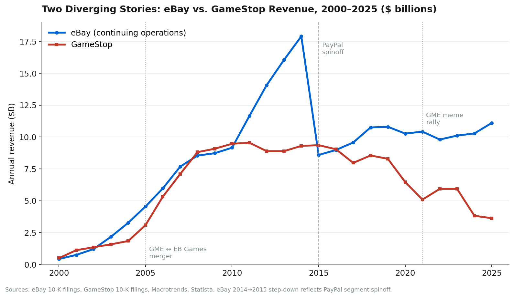
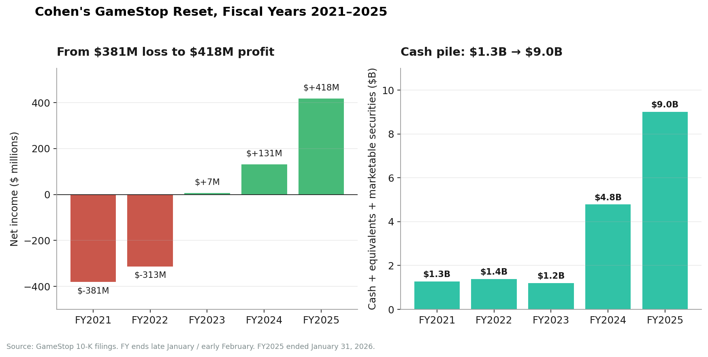
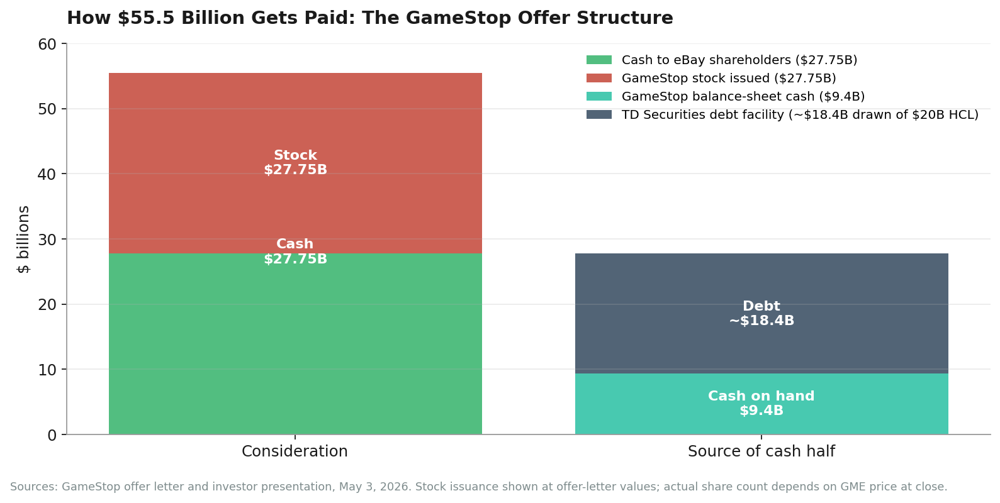
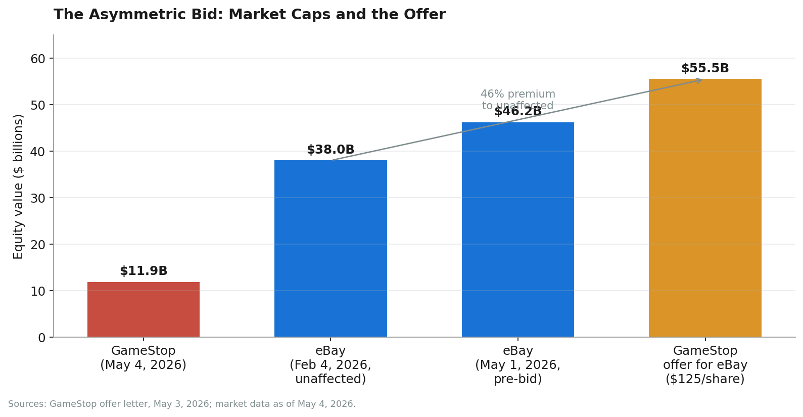

On Sunday, May 3, 2026, a Texas-based video game retailer with 2,206 stores and a market capitalization of roughly $11.9 billion sent a non-binding letter to a San Jose-based online marketplace with no stores and a market capitalization of roughly $46.2 billion, offering to buy the larger company at a 46% premium for $55.5 billion.

The letter was signed by Ryan Cohen, the chairman, CEO, 9% owner, and folk hero of GameStop Corp. It was addressed to Paul Pressler, the chairman of eBay Inc., a former Disney parks executive and former Gap CEO who is approximately twice Cohen's age and presumably did not have his Sunday night planned around this. The letter contained a pitch, a financing structure, a confidence letter from TD Securities, and a closing line that read like a particularly Ryan Cohen sentence: *"I will receive no salary, no cash bonuses, and no golden parachute — I will be compensated solely based on the performance of the combined company."*

The next morning, Cohen went on CNBC's Squawk Box. Asked how, exactly, the math of a $11.9B company offering $55.5B for a $46B company would actually work, he said: *"It's half cash, half stock, but the details are on our website."* Asked again, he said: *"I don't understand your question."* eBay's stock rose 5%, to $109 — roughly 13% below the offer price. GameStop's stock fell 10%. On Polymarket and Kalshi, the implied probability that the deal would actually close was 15% and 25%, respectively.

This is the story of how two companies — one founded in 1984 in a Dallas mall, the other in 1995 over a Labor Day weekend — arrived at this exact moment.

---

## I. eBay: The Original Network Effect (1995–2026)

### The broken laser pointer

The standard version of the eBay origin story is that Pierre Omidyar, a 28-year-old French-born Iranian-American programmer working at General Magic in Silicon Valley, started an online auction site in 1995 to help his fiancée trade Pez dispensers. This story is, charmingly, a complete fabrication. According to Adam Cohen's 2002 book *The Perfect Store* and confirmed by eBay itself, the Pez myth was fabricated to interest reporters in the site in 1997.

The actual origin is less cute. Omidyar had spent the early 1990s at Claris (an Apple subsidiary, where he worked on MacDraw II) and then at Ink Development, a pen-computing startup he co-founded that pivoted into e-commerce, rebranded as eShop, and was acquired by Microsoft in June 1996 for less than $50 million. Omidyar's cut: about $1 million. Crucially, this happened nine months *after* he had already launched a side project.

That side project went live on Labor Day weekend, Monday, September 4, 1995, on the personal website Omidyar maintained at ebay.com (which also hosted, at the time, a section about the Ebola virus). It was called AuctionWeb. The first item ever listed: a broken laser pointer, posted by Omidyar himself for $1.

A Canadian buyer named Mark Fraser bid $14.83. Omidyar emailed Fraser to make sure he understood the laser pointer was broken. Fraser replied that yes, he understood — he collected broken laser pointers. There is no better single sentence to explain why eBay would work.

### From hobby to public company (1995–1998)

The site grew faster than its hobbyist could handle. When Omidyar's internet provider raised his monthly bill from $30 to $250 because of the volume, he started charging users a fee to list items. They paid. By the end of 1995 the total value of merchandise sold on AuctionWeb reached $7.2 million.

In 1996 Omidyar quit his day job, hired employee #1 (Chris Agarpao, who would still be at the company decades later) and brought on Jeff Skoll, a Stanford MBA and his first president. In 1997 the site was rebranded eBay (the chosen name "Echo Bay" was already taken; eBay was the truncated domain Omidyar had registered). The same year, Beanie Babies became the first viral commerce moment on the site — at the height of the craze, the small stuffed animals accounted for a substantial chunk of eBay's transaction volume.

In March 1998 the board hired Meg Whitman, a Princeton/Harvard Business School alum then running Hasbro's preschool division, as CEO. She brought eBay through its IPO that September. The shares were priced at $18, expected to trade up modestly. They closed day one at $53.50.

A few months earlier, on June 10, 1999, the site went down for 22 hours — the longest eBay outage in its history. Whitman rallied more than 50 engineers from eBay and Sun Microsystems; the site was back inside a day. The 1999 outage became, in retrospect, the operational scar that pushed eBay to invest in real infrastructure. By 2000 it had 22.5 million registered users and 79.4 million auctions per quarter.

### The acquisition decade (2000–2010)

What makes eBay an interesting business school case is that it is two companies. The first is the marketplace, which has effectively just compounded on its 1990s network effect for thirty straight years. The second is the M&A program that ran from 2000 to roughly 2014, which produced one transformative acquisition, one disastrous one, and a long tail of expensive mistakes.

| Year | Acquisition / event | Price | Outcome |
|---|---|---|---|
| 2000 | Half.com | $312M (stock) | Quietly absorbed |
| 2001 | iBazar (France) | $112M | Built European footprint |
| 2002 | **PayPal** | $1.5B | The great one — became the financial spine of internet commerce |
| 2004 | Shopping.com | $620M | Comparison-shopping pivot, mostly written off |
| 2004 | Rent.com | $415M | Sold for less than $1 ten years later |
| 2005 | **Skype** | $2.6B + $1.7B earnouts | The bad one |
| 2007 | StubHub | $310M | Solid; sold in 2020 for $4.05B |
| 2008 | Skype sold | $2.7B (to Silver Lake) | Roughly broke even |
| 2010 | Critical Path / GSI | $2.4B | Enterprise commerce pivot |

The PayPal acquisition was the most important of these by an order of magnitude. eBay had spent years dealing with the fact that its core network effect — buyers and sellers who didn't know each other — required a trust layer the company itself couldn't easily provide. PayPal provided it. Within a few years, the majority of eBay transactions were settled via PayPal, and PayPal began to grow faster than eBay's own marketplace. By 2014 PayPal was a larger revenue contributor than the marketplace itself.

The Skype acquisition was the opposite. In 2005, Whitman paid $2.6 billion plus a potential $1.7 billion in earnouts for the Luxembourg-based VOIP startup founded by Niklas Zennström and Janus Friis. The strategic logic — buyers and sellers would call each other to negotiate trades — never materialized. By 2008 eBay's investors had concluded the synergies didn't exist; in 2009 Skype was sold to Silver Lake for $2.7 billion (Microsoft would buy it from Silver Lake two years later for $8.5 billion, a transaction no one at eBay enjoyed reading about).

### The Icahn split (2014–2015)

In January 2014, Carl Icahn, then 77 years old, disclosed a 0.82% stake in eBay and demanded the company spin off PayPal. eBay's then-CEO John Donahoe initially resisted. The fight was unusually public and unusually ugly — Icahn accused Donahoe of "complete disregard for accountability" and went after specific board members by name. Nine months later, on September 30, 2014, eBay capitulated. The PayPal spinoff was completed on July 18, 2015.

This is the structural break in the chart above. Pre-spinoff (2014), eBay reported $17.9 billion in revenue. Post-spinoff (2015), eBay reported $8.6 billion. The company that emerged on the other side was permanently smaller, permanently slower-growing, and permanently more dependent on its core marketplace business — exactly the business that Amazon was, by then, eating alive.

### The slow decade (2015–2024)

The post-PayPal decade is the eBay that most younger consumers actually remember: a marketplace that exists, that works, that is dwarfed by Amazon (Amazon revenue 2015: $107B; eBay's: $8.6B), and that has spent the better part of a decade trying to figure out what it wants to be.

CEO Devin Wenig, who took over from Donahoe at the spinoff, oversaw the move from PayPal to Adyen for payments processing in 2018 — saving costs, but ending an 18-year strategic relationship. He resigned in September 2019 under pressure from Elliott Management. Jamie Iannone, an eBay veteran, took over in April 2020 and pivoted the company toward what it now calls "focus categories" — collectibles, automotive parts, fashion, refurbished electronics — and "enthusiast buyers" (the ~16 million shoppers who spend more than $3,400 per year on the site).

The 2024 lay-off of 9% of the workforce, the 2025 acquisition of Tise (a Norwegian C2C reselling app) and the 2025 acquisition of Depop from Etsy are pieces of the same strategy: stop trying to compete with Amazon on horizontal commerce, double down on the categories where eBay has a structural advantage (rare, used, collectible, and enthusiast goods).

### eBay today

By the eve of the GameStop bid:

| Metric | eBay FY2025 (cal. yr ended Dec 31, 2025) |
|---|---|
| Revenue | $11.10B (+8% YoY) |
| Gross Merchandise Volume (GMV) | ~$79.7B |
| Active buyers | 135 million |
| Live listings | 2.5 billion |
| GAAP operating margin | ~20% (Q4) |
| Non-GAAP operating margin | ~26% (Q4) |
| Sales & marketing spend | ~$2.4B |
| Cash returned to shareholders (FY2025) | ~$3B (mostly buybacks) |
| Market capitalization (Feb 4, 2026, "unaffected" close) | $38.0B (~$85.84/share) |
| Market cap (May 1, 2026, last trading day pre-bid) | $46.2B (~$104.07/share) |

The picture is of a profitable, stable, slow-growing, well-run business that is no longer trying to be a growth story — and whose stock chart for most of the past five years has reflected exactly that.

This is the company GameStop wants to buy.

---

## II. GameStop: The Slowest-Motion Death and Strangest Resurrection in American Retail (1984–2026)

### From Babbage's to NeoStar (1984–1996)

GameStop did not start as GameStop. It started as Babbage's, a software retailer founded in August 1984 in the Northpark Center mall in Dallas, Texas, by two Harvard Business School classmates: James McCurry and Gary Kusin. The company was named after Charles Babbage, the 19th-century English mathematician usually credited as the inventor of the computer.

Babbage's started by selling Atari 2600 cartridges and pocket calculators. In 1987 it added Nintendo. In 1988 it went public. By 1991, two-thirds of Babbage's sales were video games — a fact that would, in retrospect, foreshadow the next 35 years of the company's history.

In 1994 Babbage's merged with Software Etc., a Minnesota-based PC software retailer founded by Daniel DeMatteo and run by Leonard Riggio (yes, that Leonard Riggio — the founder of Barnes & Noble), to form NeoStar Retail Group. The merger was a disaster. By September 1996, NeoStar couldn't get the credit line it needed to stock inventory for the holiday season and filed Chapter 11.

In November 1996, Riggio bought the assets out of bankruptcy for $58.5 million and renamed the holding company Babbage's Etc. He installed Richard "Dick" Fontaine as CEO and DeMatteo as president and COO. They would run the company for the next 13 years.

### The GameStop brand (1999–2005)

In 1999, Babbage's Etc. launched a new strip-mall-focused brand: GameStop. Thirty stores. The brand was supposed to be the company's video-game-specialist storefront, sitting alongside the older Babbage's and Software Etc. mall stores.

Then the holding company moves came in quick succession:

- **October 1999**: Barnes & Noble acquired Babbage's Etc. from Riggio (who, recall, was Barnes & Noble's chairman and principal shareholder — a related-party transaction reviewed by a special committee) for $215M.
- **May 2000**: Barnes & Noble acquired Funco, the parent of FuncoLand video-game stores, for $160M, beating out Electronics Boutique in a bidding war. The deal also included *Game Informer*, a video game magazine first published in 1991.
- **December 2000**: Funco was renamed GameStop, Inc.
- **February 2002**: GameStop IPO'd on the NYSE under the ticker **GME**, with Barnes & Noble retaining 67% of shares and 95% of voting power.
- **October 2004**: Barnes & Noble distributed its 59% stake to its shareholders. GameStop became fully independent.

The independence lasted exactly one year before the company made its largest-ever acquisition.

### EB Games and the empire (2005–2010)

On October 6, 2005, GameStop and Electronics Boutique — its longtime rival, which by then operated as EB Games — agreed to a $1.44 billion takeover. The deal offered EB Games shareholders $38.15 in cash plus ~¾ of a GameStop share for each EB Games share, a 34.2% premium. It expanded GameStop's footprint into Australia, Canada, and continental Europe (~400 EB stores across Denmark, Finland, Germany, Italy, Norway, Spain, Sweden, Switzerland) and brought combined operations to over 4,250 stores worldwide.

Three years later, in October 2008, GameStop acquired Micromania, a French video-game retailer, for $700M, adding 332 more stores. By 2010, GameStop was the dominant specialty video-game retailer in the world. Revenue: $9.5 billion. Stores: ~6,700. Market cap: roughly $3 billion.

Then the world changed.

### The slow death (2010–2019)

The killer of physical video-game retail was not a single product launch; it was a steady, decade-long compression of every revenue line.

- **Digital downloads**. Steam (2003), Xbox Live Arcade (2004), and the PlayStation Store (2006) had been small concerns when they launched. By 2015 they were the default way most non-physical-disc gamers bought their games.
- **Mobile gaming**. The iPhone App Store (2008) and Google Play (2012) created a generation of gamers who never bought a console at all.
- **Mall traffic**. American mall traffic peaked in the early 2010s and has fallen most years since.
- **Used-game margins**. GameStop's most profitable single business — buying back used games and reselling them at a margin — was structurally crippled when publishers shifted to digital downloads (no physical disc to resell) and when single-use download codes became standard.
- **Failed pivots**. The 2011 acquisition of Spawn Labs (a cloud-gaming startup that didn't work). The 2013-2018 push into smartphone retail (Cricket Wireless, Spring Mobile — eventually sold for losses). The 2015 acquisition of ThinkGeek for $140M (sold off in pieces).

By 2017, GameStop's stock was in the $20s. By mid-2019, it had dropped below $4 (split-adjusted: about $1). Hedge funds had begun to short the stock heavily on the well-supported thesis that it was the next Blockbuster.

### Michael Burry's first call (2019)

Before there was Reddit's r/wallstreetbets, there was Michael Burry — the *Big Short* hedge fund manager — quietly buying GameStop stock through his firm Scion Asset Management starting in mid-2019. Scion's thesis was that the stock had been mechanically over-shorted (over 63% of float as of July 2019) and that the company had two assets the market wasn't pricing: a still-substantial cash flow from the existing physical business, and a rapidly approaching new console cycle (PS5 and Xbox Series X, both launched in late 2020) that would temporarily revive disc sales.

Burry wrote letters to GameStop's board demanding a stock buyback. He got one. He exited the position in Q4 2020, *before* the price actually exploded — a fact he has joked about in subsequent Twitter posts.

### Enter Cohen (August 2020)

In August 2020, RC Ventures — a personal investment vehicle run by a 35-year-old former tech CEO named Ryan Cohen — disclosed a stake in GameStop. By November he held over 10%. By December he had written a public letter to the board calling for a full pivot to e-commerce.

Cohen's resume, briefly: born in Montreal, dropped out of university, started a few e-commerce ventures, and in 2011 co-founded Chewy.com (online pet food and supplies) with Michael Day. Cohen ran Chewy as CEO through 2018; PetSmart acquired the company in 2017 for $3.35 billion in what was, at the time, the largest e-commerce acquisition in U.S. history; Chewy IPO'd separately in 2019 at over $8 billion.

The Cohen pitch to GameStop's board was straightforward: stop pretending the mall stores will save you, take the cash flow they still throw off, and rebuild as a "Chewy for gamers" — an online-first specialty retailer where the brand and customer relationship matter more than the physical real estate.

The board wasn't immediately receptive. They got receptive on January 11, 2021, when Cohen, along with two other former Chewy executives — Alan Attal and Jim Grube — were appointed to the board.

### The squeeze (January 2021)

What happened next is one of the most-written-about events in modern market history, so I'll keep it tight.

- **January 4, 2021**: GME closes at $17.25 (about $4.31 split-adjusted).
- **January 11**: Cohen and the two ex-Chewy executives join the board. Stock jumps.
- **January 13–14**: r/wallstreetbets users — most prominently Keith Gill, posting as "DeepF***ingValue" / "Roaring Kitty" — post bullish positions. Buying accelerates.
- **January 19**: Andrew Left of Citron Research tweets that GameStop investors are "suckers at this poker game" and that the stock will fall back to $20.
- **January 22**: Reported short interest hits ~140% of float. (This is mathematically possible only because shorted shares can themselves be lent and re-shorted.)
- **January 27**: Stock closes at $347.51 (split-adjusted ~$87). Up roughly 20× in three weeks. Elon Musk tweets "Gamestonk!!"
- **January 28**: Robinhood — citing clearinghouse capital requirements — restricts buying of GME, AMC, and several other meme stocks, allowing only sales. The stock peaks pre-market over $500. Congressional hearings will follow. Lawsuits will follow.
- **January 29**: Melvin Capital, the largest visible short, has reportedly lost over 50% of its value. Citadel and Point72 inject $2.75B in capital. (Melvin will close in 2022.)
- **March 2021**: GameStop announces Cohen will lead a new committee on the e-commerce transition.
- **June 2021**: Cohen becomes Chairman.

The whole thing was made into a 2023 film (*Dumb Money*, with Paul Dano as Keith Gill and Seth Rogen as Gabe Plotkin). At the time, it felt like a one-off. It turned out to be Cohen acquiring the optionality to do everything that came next.

### The capital base (2021–2025)

Whatever else you think of meme stocks, here is what the squeeze did for GameStop's actual business: it allowed the company, while its share price was elevated, to issue an enormous amount of equity at very favorable terms. Combined with subsequent capital raises, the cumulative result over five years is striking:

- **April 2021**: Equity offering raises ~$551M.
- **June 2021**: Second offering raises ~$1.1B.
- **2024–2025**: $4.2B in zero-coupon convertible notes (yes — 0% interest, redeemable into GME stock). This is the kind of debt deal that only a meme stock with a cult-like retail shareholder base can pull off.
- **May–June 2025**: GameStop deploys ~$500M into 4,710 Bitcoin as a treasury asset.
- **Q2 FY2025 (Aug 2025)**: ~59M tradable warrants distributed (GME WS), strike $32, expiring October 2026 — potentially raising another ~$1.9B if exercised.

By the end of fiscal year 2025 (ending January 31, 2026), GameStop's balance sheet had been transformed:

In the same period, Cohen also took an axe to the operating side. Selling, general and administrative expenses (SG&A) fell from approximately $1.71 billion in fiscal 2021 to $910 million in fiscal 2025 — a roughly 47% reduction. The company exited France, Germany, Italy, Ireland, Switzerland, and (in May 2025) Canada. The Canadian business, sold to businessman Stephan Tétrault, will revert to the EB Games name. The store count fell from over 4,500 globally at the 2010 peak to 2,206 at the end of FY2025.

### GameStop today

| Metric | GameStop FY2025 (ended Jan 31, 2026) |
|---|---|
| Revenue | $3.63B (-5% YoY) |
| Operating income | $232M (vs. $26M loss FY2024) |
| Net income | $418M (vs. $131M FY2024) |
| Adjusted net income | $647M |
| Free cash flow | $597M |
| Cash + equivalents + marketable securities | $9.01B |
| Bitcoin holdings | 4,710 BTC, fair value $368M (as of Jan 31, 2026) |
| Long-term debt | $4.2B convertible notes, **0% coupon** |
| SG&A | $910M (down from $1.71B in FY2021) |
| Stores | 2,206 (1,598 U.S., 300 Australia, 308 Europe) |
| Collectibles % of revenue | 31.2% (up from 19.9% prior year) |
| Market cap (May 4, 2026) | ~$11.9B |

It is, structurally, a $9 billion cash pile attached to a small, modestly profitable specialty retailer with declining hardware and software sales and a fast-growing collectibles business. As the December 2025 Substack piece put it, GameStop is now closer to a financial engine in disguise than to a video-game retailer.

The financial engine had only one question left: what does it buy?

---

## III. The Pay Package and the Target

### Cohen's $35B carrot (January 2026)

In early January 2026, GameStop's board approved a new compensation package for Ryan Cohen. He receives no salary, no cash bonuses, and no golden parachute. He is paid entirely in stock options, structured around two thresholds:

1. The combined company's market capitalization must reach **$100 billion**.
2. The combined company must achieve **$10 billion in cumulative performance EBITDA**.

If both are hit, Cohen unlocks a stock package valued at over **$35 billion**. For context, GameStop's total market cap at the time was around $9 billion. To deliver this package, Cohen would have to roughly 11x the company.

Asked about it shortly after, Cohen told the *Wall Street Journal* it would be "either genius or totally, totally foolish."

In the same interview, he said his preferred path to a $100B market cap involved an acquisition in the consumer or retail space.

### Building the eBay stake (February–April 2026)

Beginning February 4, 2026 — a date that GameStop later disclosed in its Schedule 13D filing — RC Ventures and GameStop Corp. began accumulating a position in eBay through a combination of common stock and equity derivatives. The accumulation continued for roughly three months.

By the time the offer letter was sent on May 3, 2026, the combined economic stake totaled **approximately 5%** of eBay's outstanding shares.

### The letter (May 3, 2026)

The non-binding offer letter, addressed to Paul Pressler, eBay's chairman of the board, with copies to CEO Jamie Iannone and General Counsel Samantha Wellington, made the following proposal:

| Term | Detail |
|---|---|
| Offer price | **$125.00 per share** |
| Consideration mix | 50% cash / 50% GameStop common stock |
| Premium to unaffected close (Feb 4) | 46% (vs. $85.84) |
| Premium to 30-day VWAP | 27% |
| Premium to 90-day VWAP | 36% |
| Premium to last close (May 1) | 20% (vs. $104.07) |
| Aggregate equity value | ~$55.5B |
| Election rights | Shareholder choice of cash or stock, pro-rata if oversubscribed |
| Position acquired | 5% economic stake |
| Stated cost synergies | $2.0B annualized within 12 months |
| EPS impact (year 1, GAAP, claimed) | $4.26 → $7.79 |
| Post-close CEO | Ryan Cohen |
| Cohen comp at combined entity | No salary, no cash bonus, no golden parachute |

The financing was the most-scrutinized part of the letter:

The cash half of the consideration (~$27.75B) is supposed to come from two sources: GameStop's $9.4B cash pile and ~$18.4B drawn down from a $20B "highly confident letter" (HCL) signed by TD Securities. The stock half (~$27.75B) would be issued in new GameStop common shares. At GameStop's May 4 closing price, that's roughly **1 billion new shares** — more than 2× the current GameStop share count — which is why eBay shareholders' "stock" half is, in practice, an option on Cohen's ability to actually deliver synergies that justify the dilution.

### The market reaction

Two things matter here. First, the absolute size. eBay was, on May 1, 2026, worth roughly four times what GameStop was worth. Acquisitions of larger companies by smaller ones do happen — JDS Uniphase / SDL in 2000 was bigger; the AT&T / SBC reverse merger in 2005 was bigger still — but they are rare, and almost never accomplished without the smaller company's stock running higher in the meantime.

Second, the market's verdict. eBay rose to about $109 on May 4 — well below the $125 offer. That kind of muted bounce is the market saying: "We see the bid, but we don't believe it closes at $125." On Polymarket, the implied close probability sat at 15%; on Kalshi, 25%. GameStop fell 10% — investors signaling that, even setting aside whether the deal *closes*, the stock dilution and execution risk are real.

---

## IV. Genius or Foolish

Cohen himself called it. So both cases deserve a fair statement.

### The genius case

**eBay has unrealized profitability.** The company is already running ~26% non-GAAP operating margins. Sales and marketing alone is $2.4B per year on a flat user base — Cohen's argument that there is fat to cut is not crazy. If even half the $2B promised cost cuts come through, the combined company's earnings power increases materially.

**Collectibles is the fastest-growing category at both companies.** eBay's 2025 GMV was driven by trading cards (Pokemon, sports), with the 30th anniversary of Pokemon in February 2026 being one of the company's strongest single events ever. GameStop's collectibles segment grew 47.7% in fiscal 2025 to $1.06B, now 29% of GameStop's revenue. There is a real strategic logic to a single platform that owns the digital marketplace, the physical authentication network, and the in-store live-commerce broadcast capability for this category.

**The 1,600 U.S. store network has real option value.** Live commerce — the QVC-style live-video selling format that has dominated commerce in China for a decade — has been slow to scale in the U.S., partly because nobody has integrated platform inventory with physical broadcast space. eBay Live, launched in 2022, has been growing; pairing it with 1,600 GameStop locations as live-broadcast and authentication hubs is a credible "1+1=3" thesis.

**Cohen has a track record.** He grew Chewy from a single-page website in 2011 to a $3.35B acquisition six years later. He took GameStop from a $381M annual loss in fiscal 2021 to a $418M profit in fiscal 2025, while increasing cash from $1.3B to $9.0B. That is not noise — that is execution.

**The financing actually works on paper.** $9.4B cash + $20B HCL from TD = $29.4B, against a $27.75B cash component. The math, in a vacuum, balances.

### The foolish case

**The size differential is brutal.** A $11.9B acquirer offering $55.5B for a $46B target requires that the target's shareholders accept the acquirer's stock as half of the consideration. Roughly half of eBay's holders are likely to elect cash; the rest receive a paper that has just been diluted by 2x and that trades like a meme stock.

**The synergy story is less obvious than it looks.** The "1,600 stores as authentication and intake hubs" pitch sounds elegant. But eBay's existing third-party authentication program — for sneakers, watches, handbags, jewelry, and trading cards — already operates through specialized vendors and has grown rapidly without a brick-and-mortar footprint. Live commerce on eBay's existing platform is not bottlenecked by physical space.

**The $2B cost cut number is aggressive.** It implies cutting roughly 35% of eBay's S&M, 19% of its product development, and 42% of its G&A within 12 months of close. Iannone's eBay has been running a tight ship; this is not a 2014 conglomerate ripe for activist surgery.

**eBay has no obvious need to sell.** The board has a fiduciary duty to consider the offer, but eBay is profitable, returning ~$3B per year to shareholders, and currently engaged in its own strategic acquisitions (Tise, Depop). Pressler — a 70-year-old former Disney parks chief — is unlikely to see a forced exit as the legacy he wants.

**Cohen's incentives are now dubiously aligned.** The $35B comp package is structured around getting to a $100B market cap. The fastest way to get there from $11.9B is to acquire a $46B company at a 46% premium. Cohen owns ~9% of GameStop. The $2B in promised savings, if achieved, makes the deal accretive. The $2B in promised savings, if not achieved, leaves eBay shareholders holding a diluted GameStop and Cohen holding $35B in stock options. The asymmetry is not subtle.

**The "details are on our website" interview did not help.** It is rare for a CEO publicly pitching the largest acquisition of his career to be unable, on national television, to answer the question of how the deal will be financed. The market priced in that energy. eBay's board priced in that energy. They will price in more of it.

---

## V. Where Things Stand

This is the side-by-side, as of the morning of May 5, 2026:

| | **GameStop (NYSE: GME)** | **eBay (NASDAQ: EBAY)** |
|---|---|---|
| Founded | 1984 (as Babbage's), Dallas, TX | 1995 (as AuctionWeb), San Jose, CA |
| Founder(s) | Gary Kusin & James McCurry | Pierre Omidyar |
| Current CEO | Ryan Cohen (since Sept 2023) | Jamie Iannone (since Apr 2020) |
| Current Chairman | Ryan Cohen | Paul Pressler |
| HQ | Grapevine, TX | San Jose, CA |
| Stores | 2,206 | 0 |
| Employees | ~8,000 | ~10,800 |
| FY2025 revenue | $3.63B | $11.10B |
| FY2025 net income | $418M | ~$1.97B |
| Cash + equivalents + securities | $9.01B (incl. $368M BTC) | ~$5B |
| Long-term debt | $4.2B (0% coupon convertibles) | ~$8B |
| Market cap | ~$11.9B | ~$46B (post-bid jump) |
| 2025 buyback | minimal | $2.5B+ |
| 2025 dividend | none | $0.29/share quarterly |
| Active customers | ~5M PowerUp Rewards Pro | 135M active buyers |
| GMV / equivalent | ~$2.5B | $79.7B |

The asymmetry runs in every direction. GameStop has more cash on hand than eBay, despite eBay being four times its market cap. eBay has thirty times the buyers. GameStop has 2,206 more stores. eBay has four times the revenue. And the bidder's CEO has, in his communications about the deal, both an investor letter that reads as professional and a CNBC interview that does not.

The next move is eBay's. Pressler's board has acknowledged receipt and stated they will review the proposal, focusing on "the value to be delivered to eBay shareholders, including the value of the GameStop stock consideration and the ability of GameStop to deliver a binding, actionable proposal." That language — "binding, actionable" — is doing a lot of work. The current proposal is non-binding. The financing is described as "highly confident" rather than committed. Half the consideration is paper that the eBay board would need to evaluate at length.

Cohen has said he is prepared to wage a proxy fight if the board declines to engage. That is a credible threat — proxy fights at large-cap companies are expensive but doable, and GameStop's retail shareholder base would, by all indications, eat one alive on social media. But proxy fights take months, and they are won, ultimately, by who has the best story to tell to *eBay's* shareholders. So far that story is: "Take our stock at $125 implied value and trust us on the synergies."

It is also worth saying the obvious thing about the broader context: this deal exists because GameStop has, in five years, built a balance sheet far out of proportion to its operating business. That balance sheet was built on the willingness of retail investors, in 2021 and again in subsequent meme-stock cycles, to fund the company at valuations its core fundamentals could not support. That capital has been deployed conservatively for most of the post-meme period — a Bitcoin position, marketable securities, modest store optimization. This is the first time it has been deployed aggressively. Whether the bet pays off will determine whether the meme stock era of 2021 is remembered as a curiosity, or as the first time a retail investor base actually changed the strategic landscape of American business.

For now, eBay shareholders get to decide whether $125 a share, half cash and half paper, is a number they want to own. eBay's board gets to decide whether to engage. Ryan Cohen gets to decide whether to escalate. Paul Pressler, who joined the eBay board because it was a quiet, profitable Silicon Valley legacy company that didn't need much from him, gets to decide what kind of chairman he wants to be.

And the rest of us get to watch the strangest M&A pitch in modern memory unfold in real time.

---

*Sources: GameStop Form 8-K (May 4, 2026); GameStop offer letter to Paul Pressler (May 3, 2026); GameStop investor presentation, Project Sling; GameStop Form 10-K filings (fiscal years 2021–2025); eBay Inc. Form 10-K (FY2025); eBay Inc. Q1 2026, Q4 2025, Q2 2025 earnings releases; Wikipedia entries on GameStop, eBay, GameStop short squeeze, Pierre Omidyar, EB Games, Pacific City Lines (yes, that's how I got here originally); Adam Cohen,* The Perfect Store *(2002); CNBC, Squawk Box (May 4, 2026); Wall Street Journal interview with Ryan Cohen (May 3, 2026); Fortune, "Five Years After the Short Squeeze" (Jan 30, 2026); The Motley Fool; Yahoo Finance; Polymarket and Kalshi prediction markets (May 4, 2026); Macrotrends; Statista.*