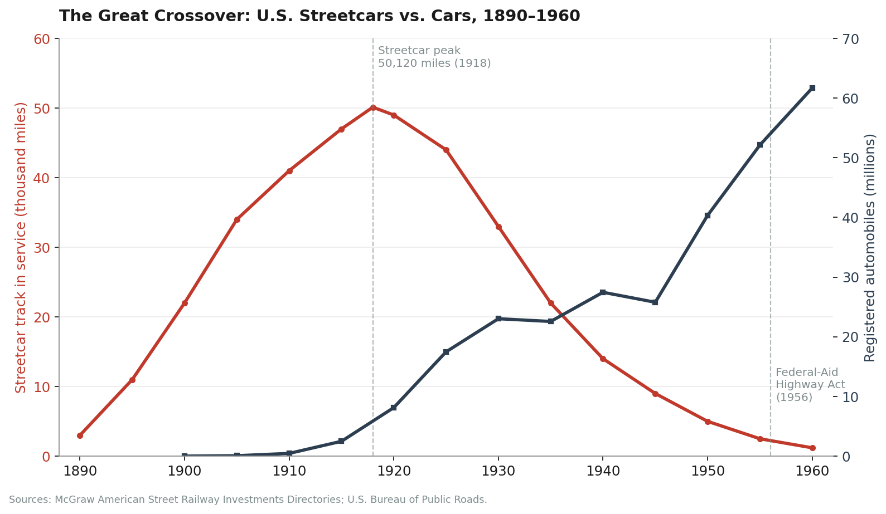
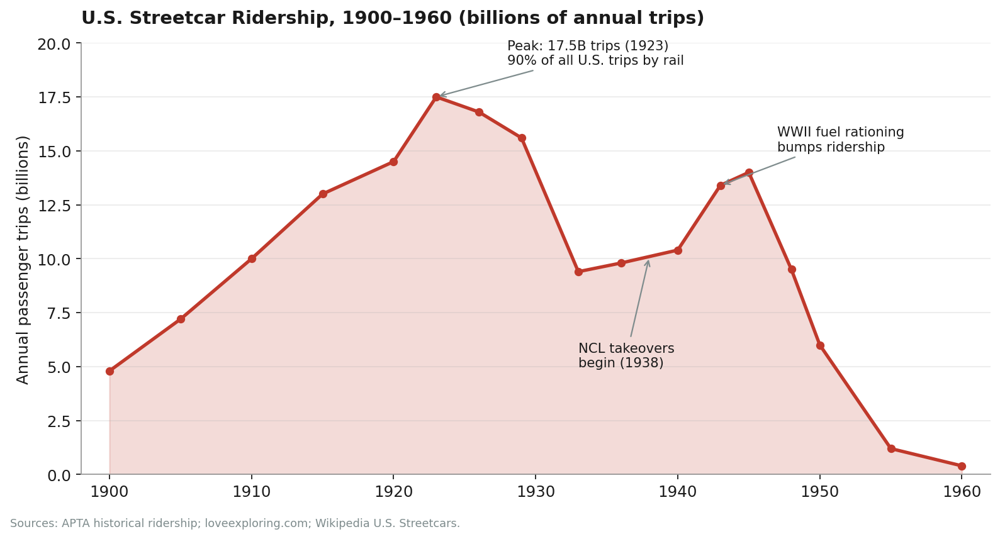
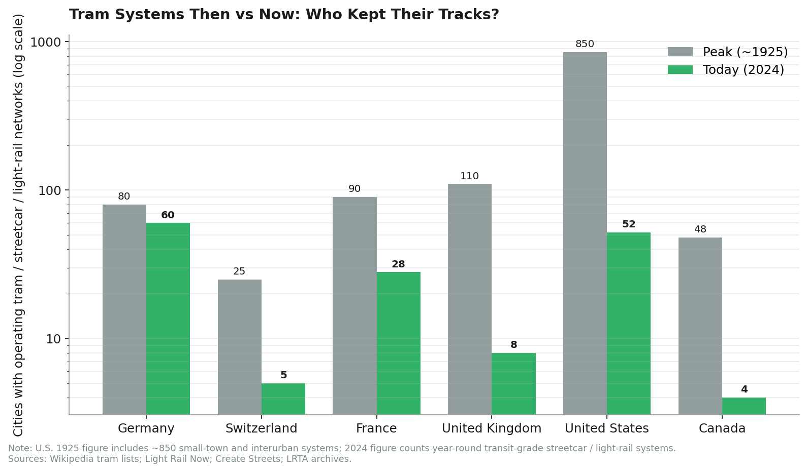
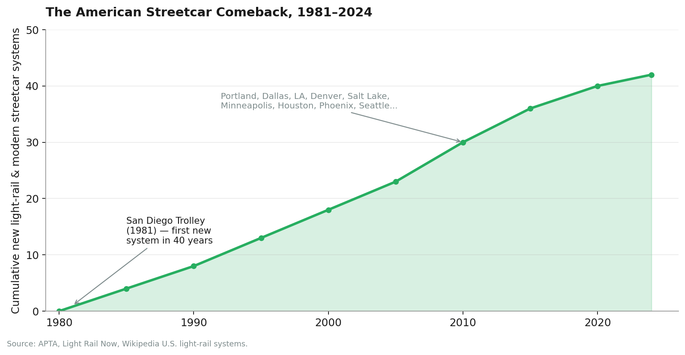

In April 1949, a federal jury in Chicago handed down a verdict that, in retrospect, looks like one of the worst pricing decisions in American legal history.

General Motors was found guilty of conspiring to monopolize the supply of buses, fuel, and tires to a holding company called National City Lines, which had spent the previous decade buying up streetcar systems in 25 American cities and converting most of them to GM diesel buses fueled by Standard Oil and rolling on Firestone tires. The fine: **$5,000**. GM's treasurer, H.C. Grossman, was personally fined **one dollar**.

Five thousand and one dollars. By the time the cheque cleared, the case was a curiosity. By the time you read this, it has become something stranger: the conspiracy-to-monopolize convictions, upheld on appeal, never received attention commensurate with their impact, and the country GM was convicted of helping to reshape — a country in which 90% of all trips were once made by rail and almost every American city of any size had its own streetcar network — is largely gone.

This is the story of how that country existed, how it died, and what we are now spending billions trying to rebuild.

---

## I. The Sprague Moment (1888)

The first streetcars were horses. Then, briefly, mules — particularly in New Orleans, where mule-drawn "bobtails" rolled through the French Quarter from the 1830s. By the mid-1880s, there were 415 street railway companies in the U.S. operating over 6,000 miles of track and carrying 188 million passengers per year using animal-drawn cars. They were slow, smelly, expensive to feed, and produced — by one contemporary estimate — about ten pounds of manure per horse per day in dense urban centers. Cities were drowning in the externalities of their own transit system.

The man who ended that was Frank J. Sprague, a former Edison engineer with a thing for direct-current motors. In 1888, Sprague electrified a streetcar line in Richmond, Virginia — twelve miles of track, forty cars, all powered through a trolley pole connecting to overhead wire. It worked. It worked spectacularly.

Within five years, the technology had eaten the United States. By 1895 almost 900 electric street railways and nearly 11,000 miles of track had been built in the United States. Within a decade and a half, the network was a continent-spanning beast: the United States network reaches an observed maximum of 80,660 km (50,120 miles) in 1918, with extensive systems in New York 10,371 km (1918), Illinois 8,818 km (1922), Pennsylvania 8,468 km (1914), Ohio 7,011 km (1907), California 6,762 km (1925), Massachusetts 6,540 km (1911).

For perspective: 50,120 miles of streetcar track in 1918 was more than the entire Interstate Highway System would be authorized to build in 1956 (41,000 miles). And it was built almost entirely with private capital.

## II. Peak Streetcar (1918–1923)

In 1920, the American streetcar was the dominant fact of urban life.

In 1920, 90% of all trips in the United States were made by rail; the nation had 1,200 electric streetcar and interurban railways with 44,000 miles of track and 15 billion annual passengers. If you lived in a city — any city — you had a streetcar within a few blocks of your home. Workers commuted on them. Couples courted on them. Department stores were built around them. Amusement parks were built at the end of them, by the streetcar companies themselves, to generate weekend ridership.

The scale was extraordinary. A few representative systems at peak:

| City | Network at peak | Notes |
|---|---|---|
| Los Angeles (Pacific Electric "Red Cars" + LA Railway "Yellow Cars") | ~2,100 miles combined, 2,150 trolleys | Los Angeles had built the world's largest trolley system by the 1920s |
| Pittsburgh (Pittsburgh Railways) | 600 miles, 99 lines | One of the densest networks in the country |
| Twin Cities (Twin City Rapid Transit) | 524 miles | stretching all the way from Stillwater to Lake Minnetonka, Anoka to Hastings |
| Sydney, Australia (for comparison) | 181 miles, ~1,600 cars in service | One of the world's busiest |
| Cincinnati | 200+ miles, 100M+ annual passengers | The chief form of public transport from the 1880s into the 1940s |

The peak in passenger trips came in 1923 at roughly 17.5 billion annual rides — a number that, for a country of 110 million people, works out to about 160 streetcar trips per person per year. Every man, woman and child in America rode a streetcar three times a week.

And then, just as the network reached its physical maximum, the cracks began to show.

## III. The Slow Bleed (1923–1938)

The streetcar industry's first crisis was not General Motors. It was math.

Most American streetcar franchises had been awarded by city governments in the 1890s and early 1900s in exchange for a fixed five-cent fare written into the franchise contract. In the deflationary 19th century, five cents was a profitable fare. After the inflation of World War I, it was a death sentence. As the century progressed, contracts locking in five-cent fares resulted in companies making losses and, over time, a lack of investment in infrastructure and the decline of services.

Compounding this were three further blows:

The **automobile**, obviously, and far earlier than people remember. U.S. car registrations went from 619,000 in 1911 to 9.2 million in 1921 to 23.1 million by 1929. The increased use of automobiles during the 1920s contributed to the decline of many streetcar lines in North America, and the decline continued during the Great Depression of the 1930s.

The **jitney** — an unregulated, gasoline-powered private taxi that picked off the most lucrative streetcar routes for a nickel. Cities banned them in waves through the 1910s, but the damage to ridership stuck.

The **Public Utility Holding Company Act of 1935**, a New Deal antitrust law that broke up the holding companies that owned many streetcar systems alongside electric utilities. The financial side-effect was brutal: it stripped streetcar operations of their cross-subsidy from profitable electric power and forced them to stand alone, fully exposed to falling ridership and frozen fares.

By the late 1930s, a great many American streetcar systems were quietly insolvent. The infrastructure was wearing out. The cars were aging. The municipalities were holding the franchise terms hostage. Buses, by contrast, required no track, no overhead wire, and no franchise renegotiation — and they could be financed by their manufacturer.

Into this opening walked the Fitzgerald brothers.

## IV. The National City Lines Years (1938–1947)

National City Lines, Inc. (NCL) was a public transportation company. The company grew out of the Fitzgerald brothers' bus operations, founded in Minnesota, United States, in 1920 as a modest local transport company operating two buses. By 1936, the Fitzgeralds had reorganized the bus operations into a holding company. In 1936, they bought 13 transit companies in Illinois, Oklahoma and Michigan, then in 1937, they replaced streetcars in Butte, Montana and made purchases in Mississippi and Texas.

Then, in 1938, came the deal that would rewrite American urban transport.

NCL took equity investment from a constellation of companies whose business interests in killing streetcars were precisely aligned: National City Lines and its subsidiaries, American City Lines and Pacific City Lines—with investment from GM, Firestone Tire, Standard Oil of California (through a subsidiary), Federal Engineering, Phillips Petroleum, and Mack Trucks—gained control of additional transit systems in about 25 cities. Systems included St. Louis, Baltimore, Los Angeles, and Oakland.

In exchange for the capital, NCL signed exclusive supply contracts: GM buses only, Firestone tires only, Standard Oil and Phillips fuels only. The bus lines' operators contracted never to buy new equipment using any fuel or means of propulsion other than petroleum.

The pattern in each acquired city was the same. NCL would take operational control. Within a few years, the streetcars would be gone — torn up, sold for scrap, sometimes shipped to other cities, often simply burned. In their place would run shiny new GM-built buses on new Firestone tires, fueled by Standard Oil. In Bellingham, Washington, businessman Tim Manning tore out the streetcars. Manning would later become an NCL executive.

The acquired cities were a roll call of American urban centers:

| City | Streetcar system acquired | Last streetcar |
|---|---|---|
| Los Angeles | LA Railway "Yellow Cars" | 1963 |
| Los Angeles | Pacific Electric "Red Cars" (via Metropolitan Coach Lines) | 1961 |
| Baltimore | Baltimore Transit Company | 1963 |
| St. Louis | St. Louis Public Service | 1966 |
| Oakland / Bay Area | Key System | 1958 |
| San Diego | San Diego Electric Railway (via outgrowth) | 1949 |
| Tulsa, OKC, Butte, Montgomery, El Paso, and ~20 more | Various | 1938–1955 |

By 1947, the conspiracy had become impossible to ignore. The federal government was watching.

## V. United States v. National City Lines (1947–1949)

On April 9, 1947, nine corporations and seven individuals (officers and directors of certain of the corporate defendants) were indicted in the Federal District Court of Southern California on counts of "conspiring to acquire control of a number of transit companies, forming a transportation monopoly" and "conspiring to monopolize sales of buses and supplies to companies owned by National City Lines" in violation of Section 1 of the Sherman Antitrust Act.

The defendants were a who's-who of mid-century American capital:

| Defendant | Role | Outcome |
|---|---|---|
| General Motors | Bus manufacturer, NCL equity holder | Convicted on Count 2; **fined $5,000** |
| Standard Oil of California (now Chevron) | Fuel supplier, NCL equity holder | Convicted on Count 2; fined $5,000 |
| Firestone Tire & Rubber (now Bridgestone) | Tire supplier, NCL equity holder | Convicted on Count 2; fined $5,000 |
| Phillips Petroleum | Fuel supplier, NCL equity holder | Convicted on Count 2 |
| Mack Trucks | Bus manufacturer, NCL equity holder | Convicted on Count 2 |
| H.C. Grossman | GM Treasurer | Convicted; **fined $1** |
| National City Lines | Holding company | Convicted on Count 2 |

The split verdict matters and is often misreported. The jury **acquitted** the defendants of Count 1 — the headline charge of conspiring to monopolize the ownership of transit systems and destroy streetcars. The jury **convicted** them of Count 2 — conspiring to monopolize the sale of buses, parts, and fuel to the transit systems they had bought. In effect, the conviction said: it is illegal for GM to be its own customer at this scale through a captive holding company, even if buying up the streetcar systems in the first place is not, by itself, an antitrust offense.

The trial judge himself wasn't sure he'd have convicted: "I am very frank to admit to counsel that after a very exhaustive review of the entire transcript in this case, and of the exhibits that were offered and received in evidence, that I might not have come to the same conclusion as the jury came to were I trying this case without a jury," he told the courtroom.

The verdict was upheld on appeal in 1951. The fines were paid. NCL kept buying, and kept converting. The last streetcar in San Diego had already run by 1949. Los Angeles' last Red Car ran in 1961. The Yellow Cars followed in 1963.

## VI. The Bradford Snell Hearing (1974)

The conspiracy story as most Americans know it today does not really come from the 1949 trial. It comes from a Senate hearing twenty-five years later.

In 1974, however, they did become a subject of Senate Antitrust and Monopoly Subcommittee hearings on the broad topic of auto industry reform. Strikingly, the subcommittee chairman, Philip Hart, was the senior senator from Michigan, where the auto industry was dominant and where GM was the dominant corporation. An assistant subcommittee counsel, Bradford Snell, had researched the conspiracy for American Ground Transport, a study financed by the Stern Fund.

Snell's testimony was electric. GM, he testified, had led the destruction of more than 100 electric-rail transit systems in forty-five cities, including New York, Los Angeles, Philadelphia, Baltimore and St. Louis. San Francisco mayor Joseph Alioto, an antitrust attorney, testified that GM "has carried on a deliberate concerted action with the oil companies and tire companies...for the purpose of destroying a vital form of competition; namely, electric rapid transit." LA mayor Tom Bradley testified that GM had "scrapped the Pacific Electric and Los Angeles streetcar systems leaving the electric train system totally destroyed."

This is the version that became *Who Framed Roger Rabbit?* in 1988 — the cartoon-noir whodunnit in which the villain Judge Doom is literally trying to buy and destroy LA's streetcar network to build freeways.

But there is a serious counter-history, and any honest write-up has to engage with it. Mainstream transit historians — Martha Bianco, Scott Bottles, Jonathan Richmond — have argued for decades that the conspiracy view overstates GM's causal role. Most transit scholars disagree, suggesting that transit system changes were brought about by other factors; economic, social, and political factors such as unrealistic capitalization, fixed fares during inflation, changes in paving and automotive technology, the Great Depression, antitrust action, the Public Utility Holding Company Act of 1935, labor unrest, market forces including declining industries' difficulty in attracting capital, rapidly increasing traffic congestion, the Good Roads Movement, urban sprawl, tax policies favoring private vehicle ownership, taxation of fixed infrastructure, consumerism, franchise repair costs for co-located property, wide diffusion of driving skills, automatic transmission buses, and general enthusiasm for the automobile.

The strongest piece of evidence for the skeptical view is also the simplest: there were hundreds upon hundreds of cities who never had a even a hint of GM/NCL/bigoil-rubber-auto influence, and they dismantled their streetcar systems just fine on their own (American cities, heck: the UK, Japan, and countless other nations have but a fraction of their original tram systems, and National City Lines wasn't there, either).

The honest answer, I think, is that both stories are true at once. GM, Firestone, and Standard Oil did conspire — that is a matter of court record, not opinion. They did accelerate the destruction of streetcar systems in roughly 25 cities, including some of the largest in the country. **And** the underlying economic decline was already in motion, driven by frozen fares, the auto, and the Depression. National City Lines did not invent the death spiral. It just made sure the streetcars never got back up.

What finished the job was something larger.

## VII. The Real Accelerant: Concrete (1956)

If you want a single piece of paper that did more to kill the American streetcar than anything Alfred Sloan ever signed, it is the Federal-Aid Highway Act of 1956.

President Eisenhower — who had been impressed by the German autobahn during WWII — signed the bill on June 29, 1956. In the act, the interstate system was expanded to 41,000 miles, and to construct the network, $25 billion—or approximately 90 percent of the construction costs—was authorized for fiscal years 1957 through 1969.

That is roughly **$250 billion in today's dollars**, deployed almost entirely to make driving faster, suburbs feasible, and dense streetcar-served urban cores obsolete. "Because of the 1956 law, and the subsequent Highway Act of 1958, the pattern of community development in America was fundamentally altered and was henceforth based on the automobile."

The 1956 Act did not break a single streetcar rail. It just funded the alternative on a scale no streetcar company could ever match. By the time Eisenhower signed, NCL had already converted most of the systems it would ever convert. The Act ensured that no rebuilding would happen for another quarter-century.

## VIII. Meanwhile, In Zurich

The reason we know GM and the highway act and the frozen fares are not, by themselves, the full story is that other countries went through the same forces — and made different choices.

Consider the data:

The most instructive case is **Germany**, which had every reason to lose its trams. It was bombed flat. It built the original autobahn. It is a manufacturing economy that produces and exports BMWs, Mercedes, Audis, Porsches, and Volkswagens at industrial scale. And yet:

Germany may be the land of Autobahns and Audis, but its true urban workhorse is the Straßenbahn, or 'street train'. While Britain and North America tore up their trams after World War II, Germany kept, and modernised, theirs. Today, an unrivalled 60 cities still run trams, stitching together new housing, walkable neighbourhoods and low-car lifestyles.

Why? A combination of denser urban form, public ownership of transit (so transit was a service, not a profit center forced to fight inflation with frozen fares), and pragmatic city councils. Unlike in the US, where privately owned and unprofitable streetcar systems were deliberately bought out and scrapped, German tram companies often remained publicly owned and focused on long-term service.

**Switzerland** is the other extreme. Switzerland is remarkable in that a few major cities kept their networks mostly intact until today. For example, although some of the tram lines extending beyond the city of Zurich closed down, the vast majority of lines within the city did not suffer any closures. Similarly, Bern and Basel kept most of their tram lines intact. A 1962 referendum in Zurich rejected a proposed underground in favor of the existing tram system. The 1973 oil crisis then locked in the Swiss preference for electric transit, and no major Swiss public-transit referendum has failed in Zurich since.

**The UK** went the American route, only earlier and harder. Britain's tram systems were mainly dismantled between 1920 and 1960, and after the closure of Glasgow's once extensive GCT network in 1962, only Blackpool's trams survived. Britain has spent the last thirty years rebuilding (Manchester 1992, Sheffield 1994, Edinburgh 2014) — but at a fraction of the original network.

**Australia** is a study in two cities making opposite choices. After World War II most Australian cities also began to replace their trams with buses, but Melbourne defied the trend, opening new tram lines even in the mid-1950s. By the 1970s Melbourne was the only Australian city with a major tram network. Sydney closed its 181-mile network in 1961. Melbourne kept going. Today Melbourne runs the largest tram network in the English-speaking world. Sydney is rebuilding its first lines.

**France** went all the way to the bottom and back up again. By 1985, there were three cities in France with operational trams. Today there are 28, including Strasbourg's flagship system, which from a standing start in 1994 has grown into one of Europe's most-used networks: In 2019, the tramway logged some 127 million trips, totaling nearly four million passenger-miles traveled, and over 220 annual trips per city-area resident.

## IX. What GM Got

It is worth asking, briefly, what the conspirators got out of any of this. The answer is: an extraordinary amount, but not because of National City Lines.

In 1929, on the eve of the crash, GM had reported net earnings of $248.3 million on sales of 1.9 million automobiles. By 1955, Alfred Sloan's GM was producing more than 4 million vehicles a year, became the first American corporation to earn $1 billion in a single year, and was the largest company in the world by revenue. By the late 1950s, one in six working Americans were employed either directly or indirectly in the automotive industry.

The streetcar conversion in 25 cities did not, by itself, build that. The Federal-Aid Highway Act of 1956 built that. The 1944 GI Bill built that, by sending returning servicemen into mortgaged single-family homes in suburbs that could only be reached by car. The streetcars dying was, for GM, less a strategy than a tailwind — and the $5,001 fine was, in retrospect, the cheapest insurance policy in the history of American capitalism.

It is also worth noting that the firms most associated with the conspiracy did *not* end the century as winners. GM filed for Chapter 11 bankruptcy in 2009 and was reorganized with U.S. government equity. Standard Oil of California became Chevron, which is fine but is not the company that once owned the world. Firestone was acquired by Japan's Bridgestone in 1988. Mack Trucks became a subsidiary of Sweden's Volvo Group in 2000. The companies that bought the streetcars are smaller, in real terms, than they were when they did it.

## X. The Long Comeback (1981–Today)

The American streetcar revival starts on July 26, 1981, when the **San Diego Trolley** — using imported German Siemens-Duewag U2 light rail vehicles — opens its first 16-mile line. It is the first new rail transit system built in a major American city in roughly forty years. It works.

What follows is one of the slowest infrastructure turnarounds in U.S. history.

City by city, decade by decade, the network has been crawling back: Portland (1986), Sacramento (1987), Buffalo, San Jose, LA (the Blue Line, 1990, on the old Pacific Electric right-of-way), St. Louis, Denver, Dallas, Salt Lake, Minneapolis, Houston, Phoenix, Charlotte, Seattle, Norfolk, Tucson, Atlanta, Detroit, Kansas City, Oklahoma City, Milwaukee, El Paso, and most recently Tempe and Santa Ana. As of March 2020, there are a total of 53 operational light rail-type lines and systems...26 modern light rail systems, 14 modern streetcar systems, and 13 heritage streetcar systems.

Some of the new lines literally retrace the old ones. This project will serve the Orange County cities of Santa Ana and Garden Grove. The line partially follows the route of the Pacific Electric railway's Santa Ana Line, which ended service in 1950.

The numbers, however, are sobering. After forty-three years of revival, the United States has roughly 52 operational light-rail / modern-streetcar systems. Germany alone has 60. The current pace of construction is also slowing: the United States experienced a modest increase in urban rail transit construction over the past four years compared to the previous period, with about 130 kilometers (81 miles) of new metro, light rail, and streetcar lines opening during the Biden Administration, up from fewer than 100 kilometers during the Trump Administration—the lowest level since the 1970s.

To put that in perspective: in a typical year between 1900 and 1918, the United States added more streetcar mileage than it has added in light-rail mileage in the entire revival period since 1981. The boom built faster than the comeback ever has.

## XI. Coda

The thing that has stayed with me, working through this story, is how cheap the destruction was.

The streetcar network of 1918 — 50,120 miles of electrified track, 1,200 systems, 17.5 billion annual rides at peak, the working transit infrastructure of an entire urbanized country — was assembled by private capital over thirty years. The dismantling, where it wasn't pure economic decline, was orchestrated through a single holding company on a budget of ordinary corporate equity, accelerated by an interstate highway system funded by federal gasoline taxes, and punished after the fact with a fine of five thousand and one dollars.

It was, in the most literal sense of the term, a steal.

What we are doing now — the second-generation light-rail systems, the modern streetcar revivals, the transit-oriented developments around new stations — is buying back, at vastly higher cost and slower pace, infrastructure that we already had and chose to throw away. A modern urban light-rail mile in the United States costs somewhere between $100M and $300M to build. We had 50,120 of them, once.

The cities that are easiest to live in without a car — Zurich, Munich, Vienna, Strasbourg, Melbourne, Toronto — are largely the cities that, at some point in the middle of the 20th century, decided they were not going to do what we did. They are not richer than us. They are not denser than every American city. They just held onto the tracks.

The streetcar didn't have to die. It mostly had to be left alone.

---

*Sources: Wikipedia's articles on the General Motors streetcar conspiracy, National City Lines, Streetcars in North America, and Trams in Europe; the McGraw American Street Railway Investments Directories aggregated in Findings (2024); Bradford Snell's American Ground Transport (1974); Jonathan Kwitny's "The Great Transportation Conspiracy" (Harper's, 1981); Scott Bottles' Los Angeles and the Automobile; Senate Antitrust Subcommittee hearings, April 1974; National Archives Federal-Aid Highway Act records; APTA historical ridership data; Light Rail Now; The Transport Politic.*