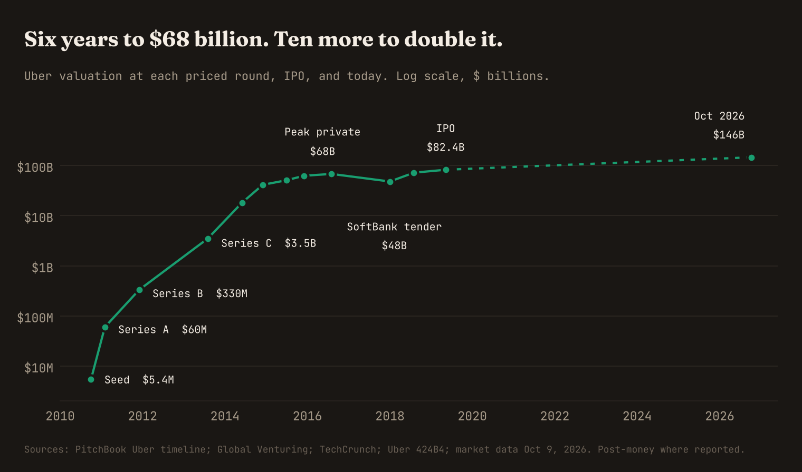
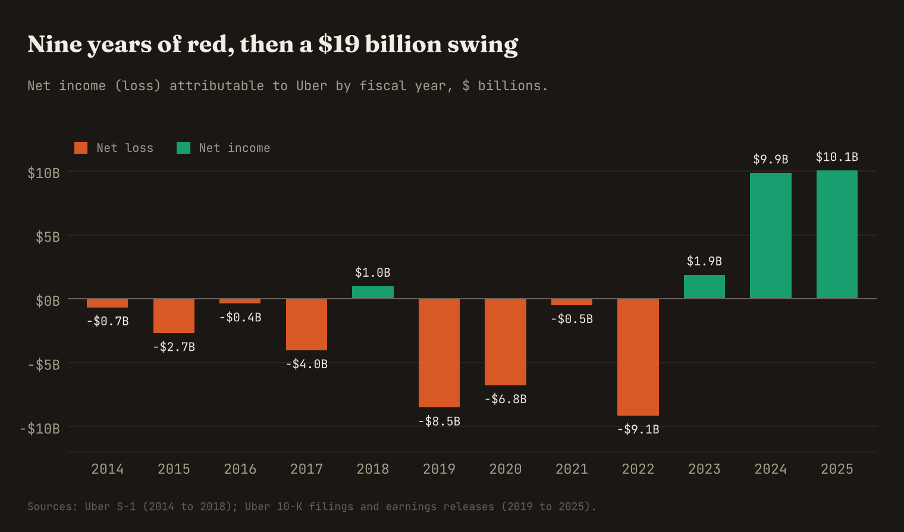
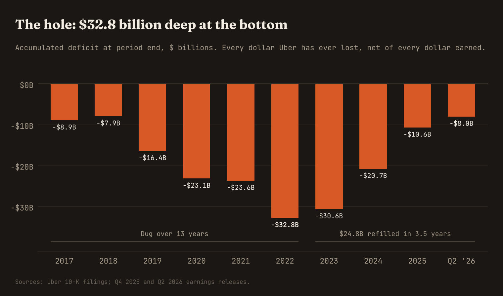

On the morning of August 5, 2026, Uber Technologies reported the best quarter in its history. Gross bookings came in at $58.0 billion, up 24% from a year earlier. The platform had 208 million monthly active users taking 3.9 billion trips in a single quarter. Operating income was $1.9 billion. And for the first time, trailing twelve month free cash flow crossed $10 billion.

The stock fell.

It fell because revenue missed estimates by a hair, and because Wall Street has spent most of 2026 wondering whether a robot is about to eat the business. But step back from the tape and look at what that press release actually said. Ten billion dollars of free cash in twelve months, from a company whose own IPO prospectus, seven years earlier, contained this sentence in the risk factors: *"We expect our operating expenses to increase significantly in the foreseeable future, and we may not achieve profitability."*

That was not lawyerly throat clearing. By the end of 2022, Uber's balance sheet carried an accumulated deficit of **$32.8 billion**. That line is the running total of every dollar a company has ever lost, net of every dollar it has ever earned. It is hard to find a venture-backed company that has ever dug one deeper.

This is the story of how the hole got dug, round by round and mistake by mistake, who walked away rich before anyone had to fill it, and how the same company refilled $24.8 billion of it in three and a half years.

---

## I. An $800 night and a tweet (2008 to 2010)

Garrett Camp had already won once. He co-founded StumbleUpon and sold it to eBay in 2007 for $75 million. Travis Kalanick had lost once and won once: his first company, the file sharing service Scour, was sued into bankruptcy by the entertainment industry, and his second, Red Swoosh, sold to Akamai in 2007 for about $19 million.

The origin story, as Uber tells it, involves the two of them and a New Year's Eve on which Camp and Kalanick spent $800 on a private driver. The other version involves a snowy night in Paris during the LeWeb conference in December 2008, with neither of them able to find a cab. Both stories point at the same idea. Camp wanted to split the cost of a black car across many riders and summon it from a phone. He registered UberCab.com, and the company was founded in March 2009. The first money in was $200,000 from Camp and Kalanick themselves.

Neither founder wanted to run it. So in January 2010, Kalanick posted a tweet looking for a product manager and business development "killer" for a pre-launch location-based startup with big equity. A 26-year-old GE employee named Ryan Graves replied: *"heres a tip. email me :)"*

Graves became employee number one in February 2010 and CEO in May, when the beta launched in San Francisco. That reply would be worth roughly $1.5 billion nine years later.

The product worked. The regulators noticed almost as fast. In October 2010, San Francisco's transit agency and the California Public Utilities Commission served UberCab with a cease-and-desist for operating as an unlicensed taxi company. The company's response set the template for the next seven years: it dropped "Cab" from the name and kept driving. In December 2010, Kalanick took over as CEO and Graves moved to COO.

One more thing happened that year. On June 15, 2010, a First Round Capital partner named Rob Hayes sent an outreach email to UberCab. First Round put $510,000 into the seed round that October, alongside Chris Sacca's Lowercase Capital, Founder Collective, and a list of angels. The round totaled roughly $1.3 million to $1.6 million depending on whose records you use, at a valuation of about $5 million.

Hold that $510,000 in your head. We will come back to it.

---

## II. The ladder: $5 million to $68 billion in six years

Here is the full climb. Figures vary slightly by source, because private rounds are announced in pieces and reported in fragments. Valuations are post-money where the source reports them.

| Date | Round | Raised | Valuation | Lead investors |
|---|---|---|---|---|
| Aug 2009 | Founders | $200K | n/a | Camp, Kalanick |
| Oct 2010 | Seed | $1.3M to $1.6M | About $5M | First Round, Lowercase |
| Feb 2011 | Series A | $11M | $60M | Benchmark |
| Dec 2011 | Series B | $32M | $330M | Menlo Ventures |
| Aug 2013 | Series C | $258M | $3.5B | Google Ventures, TPG |
| Jun 2014 | Series D | $1.2B | $18.2B | Fidelity, BlackRock |
| Dec 2014 | Series E | $1.2B | $41.2B | Glade Brook |
| Jul 2015 | Series F | $1.0B | $51B | Not disclosed |
| 2015 to 2016 | Series G | $6.6B | $62.5B to $68B | Saudi PIF, Toyota, Didi |
| Jan 2018 | SoftBank | $9.3B | $48B on tender | SoftBank, Dragoneer |
| Aug 2018 | Toyota | $500M | $72B | Toyota |
| May 2019 | IPO | $8.1B | $82.4B | Public market |

The Series B grew to about $37 million with later closings. The Series G figure includes $1 billion from Didi that came with the China sale. Of SoftBank's $9.3 billion, only about $1.25 billion was new money to the company. The rest bought out existing shareholders.

A few of these deserve a closer look.

**Series A, February 2011.** Bill Gurley of Benchmark had been hunting for a ride-hailing investment for years. He led an $11 million round at a $60 million valuation and took a board seat. Eight years later Benchmark owned 11% of the company at IPO, a stake worth about $6.8 billion at the offering price. It is one of the great venture investments ever made, and Gurley would end up leading the effort to remove the CEO he had backed.

**Series C, August 2013.** Google Ventures put in $258 million, the largest check it had ever written, at a $3.5 billion valuation. Google's chief legal officer David Drummond joined the board, alongside TPG founder David Bonderman. Four years later, Google's self-driving unit Waymo would sue Uber for stealing trade secrets. Venture capital has rarely produced a more awkward board seat.

**Series D and E, 2014.** This is the year the curve goes vertical. In June, Fidelity led $1.2 billion at $18.2 billion, with Wellington and BlackRock alongside. Mutual fund money had arrived. Six months later Uber raised another $1.2 billion at $41.2 billion. The valuation more than doubled between the summer and the winter of the same year, and the company added $1.6 billion in convertible debt from Goldman Sachs clients a month after that.

**Series G, December 2015 to mid 2016.** Priced at $48.77 per share and a $62.5 billion valuation. The anchor was Saudi Arabia's Public Investment Fund, which wrote a single $3.5 billion check in June 2016 and put its managing director on the board. At the time it was the largest single investment ever made in a private company.

Add it up and Crunchbase counts more than **$24 billion** raised from investors before the IPO. Almost no company had ever raised that much while private. And the reason Uber could raise that much is the same reason it needed to.

---

## III. Where the money went

Kalanick ran fundraising as a weapon. The logic was simple and, for a while, correct: in a market where the product is a commodity and the winner is whoever has the most drivers and the shortest wait, the company with the most cash can subsidize both sides until the competition runs out of money. Every round was a war chest, and every war chest forced the next round.

The losses came in three flavors.

**Flavor one: subsidies.** In 2012 a San Francisco startup called Lyft began letting ordinary people drive strangers in their own cars. Uber answered with UberX that July and opened it to personal vehicles in April 2013. From that point forward the two companies were buying the same drivers and the same riders with the same promotions. The S-1 later gave this spending a name: "excess Driver incentives," meaning payments to drivers that exceeded the revenue Uber earned on the trip. In the first quarter of 2019 alone, that line ran to roughly $300 million, nearly all of it at Uber Eats.

The numbers from the early years, which only became public with the S-1, are startling:

| Year | Revenue | Net loss | Loss per $1 of revenue |
|---|---|---|---|
| 2014 | $495M | $671M | $1.36 |
| 2015 | $2.0B | $2.7B | $1.35 |
| 2016 | $3.8B | $370M | $0.10 |
| 2017 | $7.9B | $4.0B | $0.51 |

In 2014 and 2015, Uber lost more than a dollar for every dollar of revenue it booked. The 2016 figure flatters: it includes a $2.9 billion gain from selling the China business. The operating loss that year was $3.0 billion.

**Flavor two: China.** Uber entered China in 2014 and ran straight into Didi, a local rival backed by Tencent, Alibaba, and eventually a $1 billion check from Apple. In February 2016 Kalanick told a Canadian tech site: *"We're profitable in the USA, but we're losing over $1 billion a year in China."* Six months later it was over. On August 1, 2016, Uber sold its China business to Didi in exchange for a 17.7% economic stake in the combined company, and Didi invested $1 billion in Uber. Uber had spent about $2 billion in two years to get there.

It felt like a defeat. It was the best trade of the Kalanick era. Uber booked a $2.9 billion gain on the disposal, kept exposure to the Chinese market, and stopped the single largest drain on its cash. Remember the shape of this deal, because Uber would run the same play twice more.

**Flavor three: moonshots.** In 2016 Uber paid $625 million for Otto, a self-driving truck startup founded by former Google engineer Anthony Levandowski. That purchase produced the Waymo lawsuit, a settlement paid in Uber equity, and a self-driving unit called the Advanced Technologies Group that consumed hundreds of millions of dollars a year. There was also Uber Elevate, the flying taxi project, and Jump, the bikes and scooters. Each one made strategic sense if you believed Uber was going to be the operating system for all movement. Each one lost money.

By the end of 2016, Uber was valued at $68 billion, operating in hundreds of cities, and losing $3 billion a year from operations. Then came 2017.

---

## IV. 2017: the year the board sued the founder

It began in January with #DeleteUber, a boycott triggered by the company's decision to keep operating during a taxi strike at JFK airport. On February 19, a former engineer named Susan Fowler published a blog post describing a year of harassment and a human resources department that protected the people responsible. Four days later Waymo sued over Otto. Days after that, a video surfaced of Kalanick arguing with one of his own drivers about falling fares.

In June, after an outside investigation, Uber fired more than 20 employees. Kalanick took a leave of absence. Then two Benchmark partners flew to Chicago, where he was interviewing a candidate, and handed him a letter from five of the company's largest investors demanding his resignation. He resigned as CEO that night.

He did not leave the board, and he still controlled three seats on it. In August 2017 Benchmark sued him in Delaware for fraud, breach of contract, and breach of fiduciary duty, asking the court to strip those seats away. The firm that led the Series A was now suing the founder it had funded. That month the board hired Dara Khosrowshahi, the CEO of Expedia, to run the company.

The lawsuit ended the way most things at Uber ended in those years: someone wrote a very large check.

**The SoftBank deal.** In January 2018, a consortium led by Masayoshi Son's Vision Fund bought roughly 17.5% of Uber. The structure was the tell. SoftBank invested about $1.25 billion of new money at the old $68 billion to $70 billion valuation, which let everyone keep saying the company had never taken a down round. Then it bought billions of dollars of existing shares from employees and early investors at about **$33 per share**, a price that valued Uber at $48 billion. That is a 30% discount to the last round, and 32% below what the Series G investors had paid two years earlier.

As part of the deal, Benchmark dropped its lawsuit, the board was restructured, and Kalanick sold 29% of his own stake for roughly $1.4 billion.

Two things are worth noticing. First, the early investors got liquidity sixteen months before the public did. Second, the most sophisticated late-stage buyer in the world looked at Uber in late 2017 and decided the right price was $48 billion, not $68 billion. The market would eventually agree with SoftBank, and then overshoot.

---

## V. The retreat and the IPO (2018 to 2019)

Khosrowshahi's first move was to stop fighting wars he could not win, using the China template.

In February 2018, Uber merged its Russian business into Yandex's taxi unit. In March 2018, it sold its Southeast Asian operations to Grab for a 27.5% stake. The S-1 shows what this did to the income statement: a **$3.2 billion gain on divestitures** and a **$2.0 billion unrealized gain** on its Didi stake. That is how Uber reported net income of $997 million in 2018 while its operating loss was $3.0 billion.

It was the first lesson in a pattern that runs through this whole story: Uber's net income line has almost never told you how the business was doing.

**May 10, 2019.** Bankers had reportedly floated a valuation as high as $120 billion the previous autumn. Uber priced at $45, the low end of its range, for a fully diluted valuation of $82.4 billion, and raised $8.1 billion. The stock opened at $42 and closed at **$41.57**, down 7.6%. TechCrunch opened its story with four words: "Ouch. Yikes. Oof. Sigh."

Every investor who had bought the Series G at $48.77 was now under water, as much as three and a half years after writing the check.

Then came the first earnings reports. In the second quarter of 2019, Uber lost **$5.24 billion**, the largest quarterly loss in its history. About $3.9 billion of that was stock-based compensation that vested on the IPO, plus a $298 million appreciation award to drivers. That same week, Khosrowshahi said something that sounded like bravado at the time: *"We could push the company to break even if we wanted to frankly."*

Full year 2019: revenue of $14.1 billion, an operating loss of $8.6 billion, and a net loss of $8.5 billion. By December, Kalanick had sold essentially all of his remaining shares and left the board. The founder was gone, the stock was under $30, and the hole was $16.4 billion deep.

---

## VI. The pandemic rewrite (2020 to 2021)

In March 2020 the stock touched **$13.71**. In the second quarter, Mobility gross bookings fell 73% from the year before. Uber's core business, moving people in cars, had more or less stopped existing.

Khosrowshahi laid off 6,700 people in May 2020, about a quarter of the workforce, and closed or consolidated 45 offices. *"Hope is not a strategy,"* he told investors. Then he did what the previous regime never would: he sold the moonshots.

- **Advanced Technologies Group**, valued at $7.25 billion in 2019, went to Aurora in December 2020, with Uber investing $400 million into Aurora as part of the deal.
- **Elevate**, the flying taxis, went to Joby Aviation.
- **Jump**, the bikes and scooters, went to Lime.

Each sale used the China structure. Uber did not take cash and walk away. It took equity in the buyer and kept the option.

At the same time, the business Uber had treated as a side project turned into the main one. Delivery gross bookings more than doubled in the second quarter of 2020. By the fourth quarter, Delivery was booking $10.05 billion a quarter against $6.79 billion for Mobility. *"The COVID crisis has moved delivery from a luxury to a utility,"* Khosrowshahi said. Uber bought Postmates for $2.65 billion in stock to press the advantage, having closed its $3.1 billion purchase of Careem in the Middle East that January.

The 2020 net loss was $6.8 billion. But the company that came out the other side had two businesses instead of one, a workforce a quarter smaller, and no science projects. By the fourth quarter of 2021 it was reporting positive adjusted EBITDA of $86 million. It was a soft metric and a small number, but it had a plus sign in front of it.

---

## VII. "Hiring as a privilege" (2022 to 2025)

On Sunday, May 8, 2022, with tech stocks collapsing and Uber trading in the mid $20s, Khosrowshahi sent an email to all employees. Markets, he wrote, were going through a "seismic shift." The company would now be judged on free cash flow, not adjusted EBITDA. *"We have to make sure our unit economics work before we go big."* And the line that got quoted everywhere: *"We will treat hiring as a privilege."*

The reported results for 2022 look like a disaster: a **$9.1 billion net loss**, the worst in company history. Almost none of it was operational. In the first quarter alone, Uber took a $5.6 billion charge to mark down its stakes in Grab, Aurora, and Didi, the same stakes it had collected by retreating. The operating loss for the full year was $1.8 billion and shrinking fast, and free cash flow was positive at $390 million.

That is the bottom of the hole. December 31, 2022: accumulated deficit of $32.8 billion.

Then the machine switched on.

| Year | Revenue | Operating income (loss) | Net income (loss) | Free cash flow |
|---|---|---|---|---|
| 2019 | $14.1B | ($8.6B) | ($8.5B) | Negative |
| 2020 | $11.1B | ($4.9B) | ($6.8B) | Negative |
| 2021 | $17.5B | ($3.8B) | ($0.5B) | Negative |
| 2022 | $31.9B | ($1.8B) | ($9.1B) | $0.4B |
| 2023 | $37.3B | $1.1B | $1.9B | $3.4B |
| 2024 | $44.0B | $2.8B | $9.9B | $6.9B |
| 2025 | $52.0B | $5.6B | $10.1B | $9.8B |

In 2023, Uber posted its first annual operating profit: $1.1 billion. Khosrowshahi called it "an inflection point." That December the company joined the S&P 500. In February 2024 it announced the first share buyback in its history, $7 billion, which CFO Prashanth Mahendra-Rajah called "a vote of confidence in the company's strong financial momentum."

From 2016 through 2022 alone, Uber's operating losses totaled about **$29 billion**. In the three years that followed, it earned $9.5 billion in operating income and generated $20 billion of free cash flow.

A caution on the net income column, because it flatters in the same way 2022 punished. The $9.9 billion in 2024 includes a $6.4 billion tax benefit from releasing a valuation allowance, which is the accounting recognition that all those years of losses will now shelter future profits. The $10.1 billion in 2025 includes another $5.0 billion of the same. Strip those out and Uber's underlying earnings are closer to operating income: $5.6 billion in 2025, on a 10.7% margin. That is a very good business. It is not a $10 billion a year business yet, except in cash.

---

## VIII. Uber in October 2026

Here is where things stand today.

**The scale.** Full year 2025: $193.5 billion in gross bookings, $52.0 billion in revenue, 13.6 billion trips. Second quarter of 2026: $58.0 billion in bookings, 208 million monthly users, operating income of $1.9 billion, free cash flow of $2.8 billion. The accumulated deficit stood at $7.95 billion on June 30.

**The stock.** Uber closed Friday, October 9 at about $71.50, a market cap of roughly $146 billion. That is 30% below its September 2025 high of $101.99 and close to where it traded in early 2024. It trades at around 15 times trailing earnings and a free cash flow yield near 7%.

**Why the discount.** Three things.

First, the quality of growth. Reported revenue rose only 12% in the second quarter against 24% bookings growth, because what Uber calls business model changes cut eight points off reported revenue growth. Mobility revenue was roughly flat while Mobility bookings grew about 20%, and the segment's revenue margin dropped from 30.7% to 25.4%. Management says this is accounting. Investors have heard Uber explain away numbers before.

Second, the largest acquisition in company history. On July 16, 2026, Uber agreed to buy Delivery Hero, the Berlin-based food delivery group, for **$14.8 billion**: EUR 41.50 per share in cash, a 108% premium to the unaffected price. Uber already holds about 24.8% of the shares directly and another 11.7% through derivatives, and Prosus has committed to tender its 16.7%. The combined platform would operate in 99 markets with $236 billion in gross bookings. It also does not close until the second half of 2027, the systems migration runs into 2029, and Uber spent about $4 billion buying Delivery Hero stock in the second quarter, which slowed its buybacks. A company that got healthy by retreating from far-flung markets is now buying its way back into dozens of them.

Third, and largest: robots. Waymo runs its own app. Tesla is building its own network. If the car drives itself, the argument goes, nobody needs a marketplace of human drivers, and Uber's two-sided network becomes a one-sided customer list. Uber's answer is to be the demand layer for everyone else. It has autonomous vehicles live in seven cities, including Las Vegas, the Bay Area, Los Angeles, Atlanta, Dallas, Austin, and London, with eight more planned by year end. Its partner list runs from Waymo and Zoox to Baidu, Pony.ai, Wayve, Lucid, Nissan, and Volkswagen. It has committed to a $10 billion multi-year autonomous investment program, including up to $1.25 billion into Rivian for as many as 50,000 robotaxis through 2031.

Read that last paragraph again with Section III in mind. The company that sold its self-driving unit in 2020 to stop the bleeding is now putting $10 billion back into self-driving. The difference, management would say, is that this time the money comes from cash flow rather than from the Saudi sovereign fund, and that partners have raised $2.50 from outside investors for every $1 Uber has put in.

And in September, Uber announced it would cut about 3,300 jobs, roughly 10% of its 34,000 employees, and 20% of management roles. Management said AI coding tools had doubled engineering output. The hiring-as-a-privilege memo, four years on.

---

## IX. Who actually made money

This is the part of the Uber story that matters most for anyone who invests in anything. The company created an enormous amount of value. Who captured it depended almost entirely on when they bought.

| Investor | Entry | Cost | Outcome |
|---|---|---|---|
| First Round Capital | Seed, 2010 | $510K | $1.7B at IPO |
| Benchmark | Series A, 2011 | Led $11M round | $6.8B at IPO |
| Ryan Graves | Hired 2010 | One tweet | $1.5B at IPO |
| Garrett Camp | Founder | n/a | $3.7B at IPO |
| Travis Kalanick | Founder | n/a | $5.3B at IPO |
| Series G funds | 2015 to 2016 | $48.77 a share | Up 47% in 11 years |
| SoftBank | Jan 2018 | $34.50 a share | Sold in 2022 at $41.47 |
| IPO buyers | May 2019 | $45.00 a share | Up 59% in 7.4 years |

IPO values are at the $45 offering price: First Round's 37.7 million remaining shares, Benchmark's 11%, Camp's 6%, and Kalanick's 8.6%, which was what he had left after selling $1.4 billion to SoftBank. Current returns use the October 9 close of about $71.50.

Three observations.

**The seed check returned more than three thousand times its money.** First Round's $510,000 became $1.7 billion on the shares it still held at the IPO. Benchmark's Series A is on any list of the [greatest venture bets](/field-notes/greatest-vc-bets) ever placed. Venture capital at the early stage did exactly what it is supposed to do.

**Almost all of the value was captured before 2015.** An investor who bought the Series G in December 2015 at $48.77 has earned about 3.6% a year for nearly eleven years, which is not much more than a Treasury bond would have paid, with a 70% drawdown along the way. An investor who bought the IPO has earned 6.4% a year. Over the same 7.4 years, the S&P 500 ETF is up about 170% on price alone, or roughly 14% a year. Uber went from a $60 million company to a $68 billion company in private. It went from $82 billion to $146 billion in public. The public got the smaller multiple and all of the volatility.

**The smartest money mistimed the exit.** SoftBank's read in 2017 was right: Uber was worth $48 billion, not $68 billion. It bought at about $33 to $34.50 a share. Then, with the Vision Fund posting record losses in 2022, it sold its entire position at an average of $41.47, within weeks of the stock's 2022 low and just as Uber was turning free cash flow positive for the first time. Those shares would be worth about 72% more today. Son was right about the price and wrong about the patience, because his own fund's problems forced his hand.

---

## X. The playbook

What does the Uber story actually teach? Five things.

**1. Capital as a moat works until it becomes the business model.** Kalanick was right that the best funded company would win the United States. He was wrong that the same logic applied in China, in Southeast Asia, in Russia, in self-driving, and in flying cars all at once. The moat was real. The mistake was believing it was portable.

**2. The best trades were the retreats.** China to Didi. Southeast Asia to Grab. Russia to Yandex. ATG to Aurora. Elevate to Joby. In each case Uber stopped the cash drain and kept an equity stake. Those stakes produced billions in gains on the way in and a $5.6 billion paper loss in a single quarter on the way out, but the operating business never had to fund those wars again. Knowing which markets to stop fighting for was worth more than winning any of them.

**3. The losses were never one thing.** Subsidies were a competitive cost that disappeared when the competition got tired. Moonshots were a choice that ended with a change of CEO. Stock compensation at the IPO and marks on equity stakes were accounting. People who looked at a $9.1 billion loss in 2022 and concluded the business was broken were reading the wrong line. People who looked at $9.9 billion of net income in 2024 and concluded it was fixed were reading the same wrong line. Operating income and free cash flow told the truth in both directions.

**4. The second product saved the first.** Uber Eats launched in August 2014 as an experiment. In 2020 it was the only reason the company still had revenue. Today the cross-sell between rides and delivery is the core of the platform argument, and it is the thing a single-product robotaxi operator does not have.

**5. Profitability was a decision.** Khosrowshahi said in August 2019 that he could push the company to break even if he wanted to. It took a pandemic and a market crash to make him want to. Once free cash flow became the goal in May 2022, the company was there within months and at a $10 billion run rate within four years. The business model did not change in 2022. The willingness to stop spending did.

---

## XI. Bull, bear, and the last $7.95 billion

**The bull case** is the cash. More than $10 billion of trailing free cash flow against a $146 billion market cap, bookings growing above 20% for four straight quarters, a share count that has started to shrink, and a stated plan to return about half of free cash flow through buybacks. If autonomy arrives slowly and unevenly, city by city and operator by operator, then the company that already has 208 million customers opening its app is the natural place for every robotaxi fleet to find riders. On that view, Uber at 15 times earnings is a toll road being priced like a taxi company.

**The bear case** is that the toll road only exists because drivers are fragmented. Millions of independent drivers need a marketplace. Three or four companies that each own a hundred thousand robotaxis do not, at least not on Uber's terms. Add the Delivery Hero integration, which is exactly the kind of sprawling international bet the company spent 2016 to 2020 unwinding, and a $10 billion autonomous capital program that makes an asset-light business heavier. The fear is not that Uber goes back to losing money. It is that the margin it just learned to earn gets competed away by its own suppliers.

I do not know which of those is right, and nothing here is investment advice. But there is one number I keep coming back to.

On June 30, 2026, Uber's accumulated deficit was $7.95 billion. Seventeen years after it was founded, after more than $24 billion of private capital, an $8.1 billion IPO, a founder forced out, a pandemic, and one of the most dramatic financial turnarounds in recent memory, Uber has still, cumulatively, never made a dollar.

At the pace of the first half of 2026, that changes around the end of 2027. The hole gets filled. The day it happens will not be a headline, because it is only a line on a balance sheet. But it will mark the point where a company that spent thirteen years proving how much money a startup can lose finally finishes proving the other thing.

---

## Sources

- Uber Technologies, [Form 424B4 prospectus](https://www.sec.gov/Archives/edgar/data/1543151/000119312519144716/d647752d424b4.htm), May 2019, and [Form S-1](https://www.sec.gov/Archives/edgar/data/1543151/000119312519103850/d647752ds1.htm), April 2019
- Uber, [Results for Fourth Quarter and Full Year 2025](https://www.businesswire.com/news/home/20260204947622/en/Uber-Announces-Results-for-Fourth-Quarter-and-Full-Year-2025)
- Uber, [Results for Second Quarter 2026](https://finance.yahoo.com/markets/stocks/articles/uber-announces-results-second-quarter-105500632.html)
- Uber, [Fourth Quarter and Full Year 2020 results](https://www.sec.gov/Archives/edgar/data/1543151/000154315121000008/uberq420earningspressrelea.htm) and [First Quarter 2022 results](https://www.sec.gov/Archives/edgar/data/1543151/000154315122000012/uberq122earningspressrelea.htm)
- Uber, [Offer Document for the Takeover Offer for Delivery Hero](https://investor.uber.com/news-events/news/press-release-details/2026/Uber-Publishes-Offer-Document-for-its-Takeover-Offer-for-Delivery-Hero/default.aspx)
- PitchBook, [Uber funding timeline](https://files.pitchbook.com/website/files/pdf/Uber-Timeline-v2.2.pdf)
- Global Venturing, [Uber hitches ride to Google's $258m](https://globalventuring.com/blog/2013/08/24/uber-hitches-ride-to-googles-258m/)
- The Motley Fool, [How Much Is Uber Worth Right Now?](https://www.fool.com/investing/2017/12/12/how-much-is-uber-worth-right-now.aspx)
- CNBC, [Uber losing $1 billion a year in China](https://www.cnbc.com/2016/02/18/uber-losing-1-billion-a-year-in-china.html) and [Didi Chuxing to buy Uber's China business](https://www.cnbc.com/2016/08/01/chinas-didi-chuxing-to-acquire-ubers-chinese-operations-wsj.html)
- TechCrunch, [SoftBank confirms Benchmark and Menlo will be selling Uber shares](https://techcrunch.com/2017/11/28/softbank-confirms-that-benchmark-and-menlo-will-be-selling-uber-shares) and [Uber's first day as a public company](https://techcrunch.com/2019/05/10/ubers-first-day-as-a-public-company-didnt-go-so-well)
- CNN, [Who gets rich from the Uber IPO](https://amp.cnn.com/cnn/2019/05/10/tech/uber-ipo-who-gets-rich)
- The Philadelphia Inquirer, [First Round Capital's Uber return](https://www.inquirer.com/news/uber-ipo-early-stage-investors-return-first-round-capital-20190513.html)
- CNBC, [Uber prices IPO at $45 per share](https://www.cnbc.com/amp/2019/05/09/uber-ipo-pricing.html)
- CBC, [Uber loses $5.24B in Q2 after post-IPO stock payouts](https://amp.cbc.ca/lite/story/1.5240793)
- Fortune, [Khosrowshahi memo: hiring as a privilege](https://fortune.com/2022/05/09/uber-ceo-dara-khosrowshahi-tells-staff-memo-hiring-privilege-hardcore-on-costs)
- CNBC, [SoftBank sells entire stake in Uber](https://www.cnbc.com/2022/08/08/softbank-sells-entire-stake-in-uber-as-vision-fund-losses-mount.html) and [Uber unveils $7 billion buyback](https://www.cnbc.com/2024/02/14/uber-unveils-7-billion-share-buyback-after-first-profitable-year-.html)
- City A.M., [Uber reports first ever full-year operating profit](https://www.cityam.com/uber-reports-first-ever-full-year-operating-profit-as-chief-hails-an-inflection-point/)
- Quartz, [Uber acquires Delivery Hero in $14.8 billion deal](https://qz.com/uber-acquisition-delivery-hero-14-billion-071626)
- Investing.com, [Uber Q2 2026: bookings surge 22%, stock falls on revenue miss](https://www.investing.com/news/company-news/uber-q2-2026-slides-bookings-surge-22-stock-falls-on-revenue-miss-93CH-4837741)
- 24/7 Wall St., [Uber is slashing another 10% of its workforce](https://247wallst.com/investing/2026/09/03/down-6-in-2026-uber-is-slashing-another-10-of-its-workforce/)
- Market data as of the close on October 9, 2026
